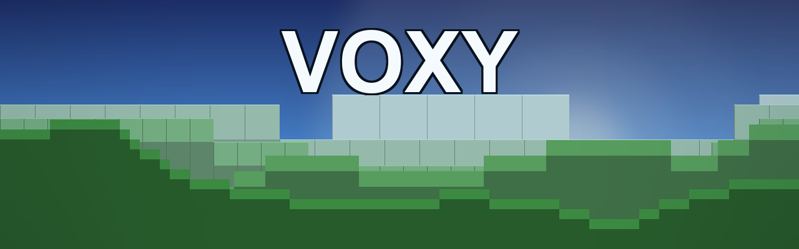

# Voxy — NeoForge 1.21.1

> **Unofficial NeoForge 1.21.1 port of [Voxy](https://github.com/MCRcortex/voxy) by [MCRcortex](https://github.com/MCRcortex).**
> All credit for Voxy goes to MCRcortex — this is a community port so the mod can be played on NeoForge 1.21.1 with the modern Sodium 0.8 backport. Please respect the original author's work and licensing.

## What is Voxy?

**Voxy** is a Level-of-Detail (LOD) rendering mod that pushes your view distance *far* beyond vanilla limits. Distant terrain is rendered as voxel LODs — detailed up close, progressively simplified into the distance — so you can see for thousands of blocks without the performance cost of full-detail chunks.

If you've ever wanted to stand on a mountain and actually *see* the world stretch to the horizon, that's Voxy.

## Features

- 🌍 **Massive view distances** — render terrain far past vanilla's limit
- 🧊 **Voxel LODs** — distant chunks become efficient low-detail voxels
- ✨ **Seamless transitions** — no see-through gap when chunks hand off between full detail and LOD
- 🌫️ **Fog integration** — blends naturally at the LOD boundary
- 🎨 **Full block rendering** — solid, cutout, cutout-mipped and translucent render types
- ⚡ **Built on Sodium** — works with the modern Sodium 0.8 rendering pipeline

## Screenshots

<!--
Add your own in-game screenshots here, for example:

-->

*Screenshots coming soon — capture a high render-distance vista in your world to show it off!*

## Requirements

| Dependency | Version |
|------------|---------|
| **Minecraft** | 1.21.1 |
| **NeoForge** | 21.1.219 or newer |
| **[Sodium](https://modrinth.com/mod/sodium)** | `mc1.21.1-0.8.12-beta.2-neoforge` (or newer 0.8.x) |
| **[Forgified Fabric API](https://modrinth.com/mod/forgified-fabric-api)** | `0.116.7+2.2.0+1.21.1` |

**Recommended:** [Lithium](https://modrinth.com/mod/lithium) for general performance.

> ⚠️ Voxy requires the **modern Sodium 0.8** backport for 1.21.1. It will not work with Sodium 0.6.x.

## Installation

1. Install **NeoForge 21.1.219+** for Minecraft 1.21.1.
2. Drop these into your `mods` folder:
   - Voxy (this file)
   - Sodium `0.8.12-beta.2`
   - Forgified Fabric API
   - (optional) Lithium
3. Launch the game. Configure Voxy from **Mods → Voxy → Config**.

## Notes & Limitations

- The in-game Voxy page inside Sodium's video-settings menu isn't available on Sodium 0.8 (that API was rewritten) — use the Mods config menu instead.
- Some optional integrations (Iris, Nvidium, Vivecraft) aren't ported yet.

## Credits & License

Original mod and all rendering work by **[MCRcortex](https://github.com/MCRcortex)**. The original Voxy is licensed **All Rights Reserved**; this NeoForge port is provided for personal use. Please do not redistribute compiled builds against the author's wishes.
